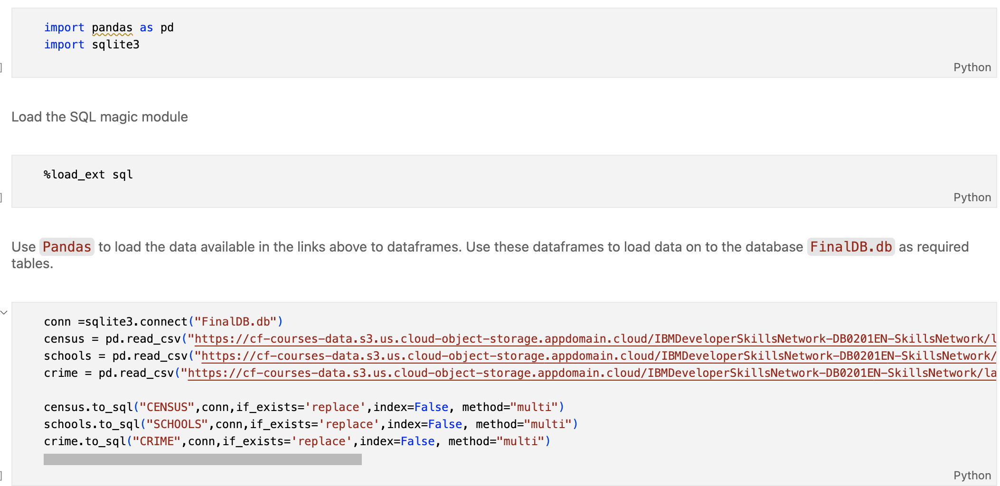
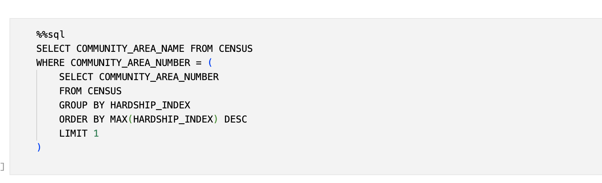
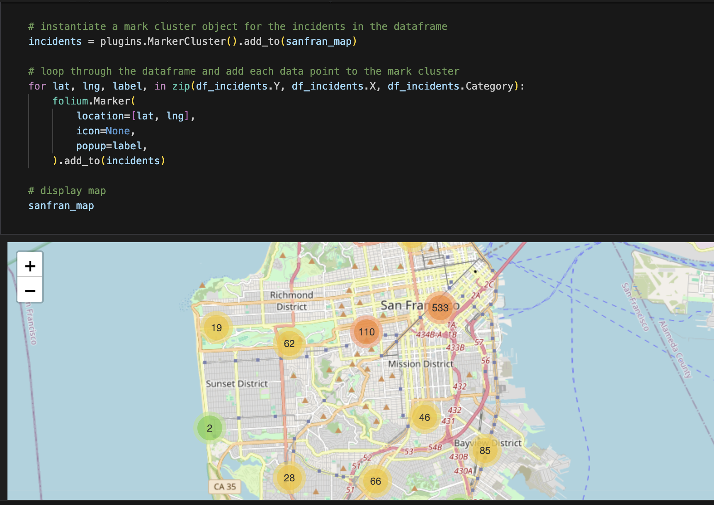
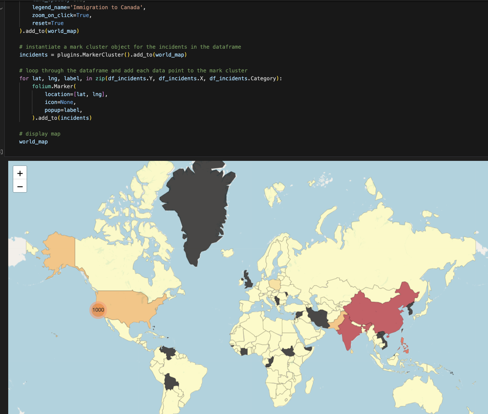
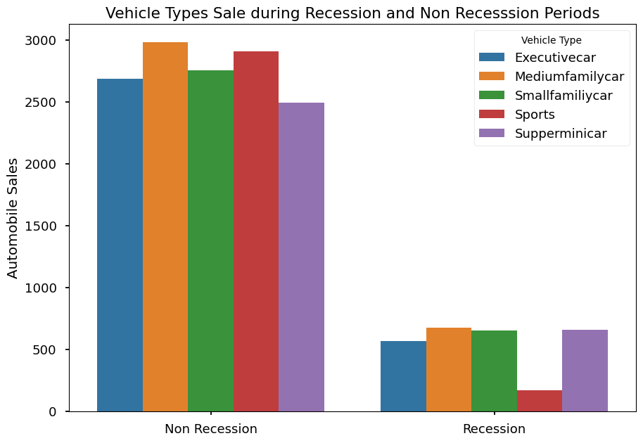
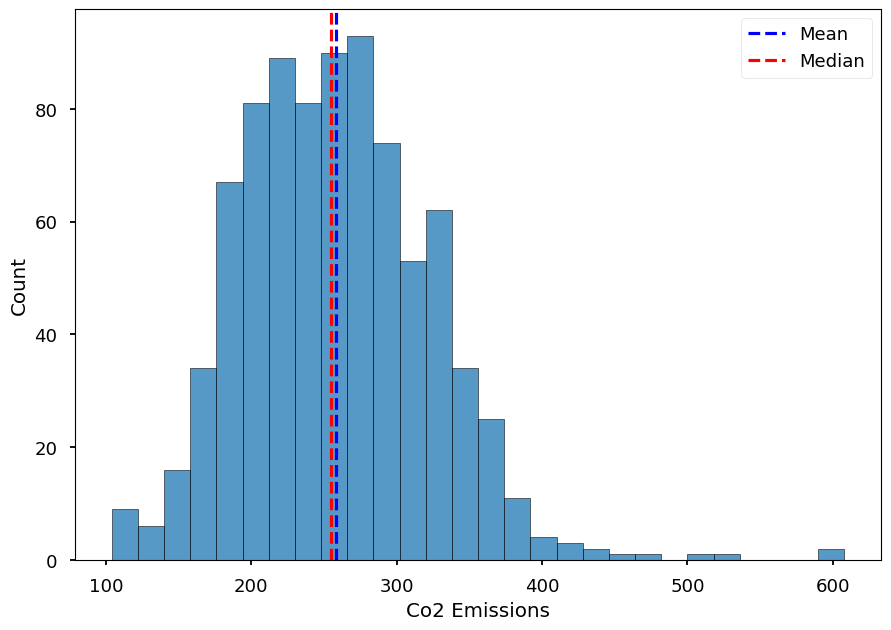
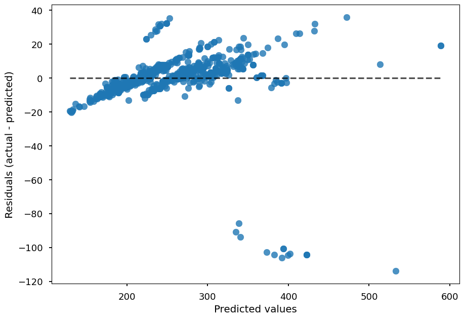

# IBM Data Science
This repository contains hands-on completed work following the IBM Data Science professional certification on Coursera

## What is Data Science
I learnt how the CRISP-DM methodology aligns with the research methods I’ve been using in the mobile computing and well-being field. The course's practical insights and real-world applications, coupled with hands-on peer-reviewed exercises, made it a truly rewarding experience.

[Certificate of Completion](https://www.coursera.org/account/accomplishments/verify/MGUNWY77TWBN)

## Python for Data Science, AI  & Development
I refreshed my Python knowledge in data structures such as lists, sets, dictionaries, functions Classes, using Pandas, Numpy, string manipulation, web scrapping using Pandas and BeautifulSoup.

[Source](./web_scrapping/)

[Certificate of Completion](https://www.coursera.org/account/accomplishments/verify/W9A5M2FFUEY5)

## Databases and SQL for Data Science with Python
I refreshed my working knowledge of SQL. 🎓💻 It was an engaging experience querying the publicly available City of Chicago crimes, socioeconomic, and schools dataset within Jupyter Notebook, **with Python DB-API, pandas, SQL Magic and a focus on SQL optimization**. 

Revisiting stored procedures and ACID transactions, brought back a wave of nostalgia from 2012 ⏳ when I was involved in developing the Attendance Management System at Students Loan Trust Fund Ghana 🇬🇭. This reflection led me to read about the evolving role of stored procedures in modern data-driven production systems, weighing their pros and cons, and considering aspects like application testability and the separation of data and business logic.





[Source](./database/)

[Certificate of Completion](https://www.coursera.org/account/accomplishments/verify/FXN2LMYKS0BH)


## Data Analysis with Python
While I have previously used statistical regression methods, including multi-level modelling in my work on predicting depression symptom severity using behavioural data 📲 🛌 🚶‍♂️ 🤸‍♀️ passively collected via smartphones and ŌURA ring [[1](https://www.sciencedirect.com/science/article/pii/S1574119222000566), [2](https://www.frontiersin.org/journals/psychiatry/articles/10.3389/fpsyt.2021.625247/full)], in this course, I focused on machine learning regression techniques. 

I explored **Linear, Multi-linear, Polynomial, and Ridge regression using Scikit-learn, Seaborn, and Pandas and gained new insights into Exploratory Data Analysis**.

[Source](./data_analysis/)

[Certificate of Completion](https://www.coursera.org/account/accomplishments/verify/IBRF87JTMPFL)

This plot shows a heatmap of the correlation matrix between various features of the Houses.


## Data Visualization with Python
As Data visualion is a essential part of Data Science, I advanced my working knowledge in Data Visualization with Python through this course. I have previously developed data analysis and compliance dashboards using R Shiny, and conducted exploratory data analysis of smartphone and wearable datasets with ggplot2 in R. In this coourse, **I enhanced my skills in Python, using tools like Folium for geospatial data visualization (clustered markers, choropleth maps), Matplotlib, Seaborn, Pandas, and building dashboards with Plotly Dash**.

During the course, I explored and visualized interesting real-world datasets, such as the United Nations Population data on immigration to Canada, the Australian wildfire dataset, and the United States  automobile sales during recession and non-recession periods. I also deepened my understanding of the Python Data Visualization ecosystem, comparing tools like Streamlit, Plotly Dash, and Panel in terms of production readiness, ease of development and integration with other plotting libraries.

[Source](./data_visualisation/) 

[Certificate of completion](https://coursera.org/share/7df2fe9692ca65e50e23b4b1b1a04801)

Below is a visualisation of crimes in the San Francisco Crimes dataset. Markers are clustered together. Click a cluster expand to show the markers within the cluster. 


Here, we see a choropleth showing annual imigration to Canada from various countries. 


This plot visualizes Autombile sales per vehicle type in the United States during recession and non recession periods. 



## Machine Learning with Python

I refreshed my working knowledge in Machining Learning. In my [previous scientific research work](https://www.sciencedirect.com/science/article/pii/S1574119222000566), I leveraged an ensemble of classifiers to predict the depression status of participants using behavioural data 📲 🛌 🚶‍♂️ 🤸‍♀️ passively collected via smartphones and ŌURA ring. In this course, **I revisited the theoretical aspects of Regression, Classification and Clustering**.  Does on need efficient car engines, drive smaller engine size cars or switch to EV to reduce CO2 emissions ? Those were the question that led my curiosity in analysing Fuel consumption and C02 emission data publicly available from the Canadian Open Government portal.  With 9 out of 12 courses completed, I am inching closer to the final goal of obtaining the IBM Data Science Professional certificate.  Next up is an Applied Machine Learning capstone project. 

[Source](./machine_learning/) 

[Certificate of completion](https://coursera.org/share/762a19f6e96c3d2901423646bfabee84)

```python

sns.histplot(x=df.Co2_Emissions)
plt.axvline(df.Co2_Emissions.mean(), color="b", linestyle="dashed", label="Mean")
plt.axvline(df.Co2_Emissions.median(), color="r", linestyle="dashed", label="Median")
plt.xlabel("Co2 Emissions")
plt.legend()
plt.show()

```
The Distribution of C02 emissions is more closer to a normal distribution, given that the mean and median are almost equal. Are there any outliers ?



Distribution plot of true and predicted CO2 Emissions. The model makes higher errors in predicting Co2 Emisisons in ranges 200-300. More dataset in these might improve the performance. Examining the residual plot


A residual plot for the prediction of Co2 Emissions. The residual plots shows a very that Multiple Linear Regression is not best estimator given the feature set. There is a pattern in the residual plots 
